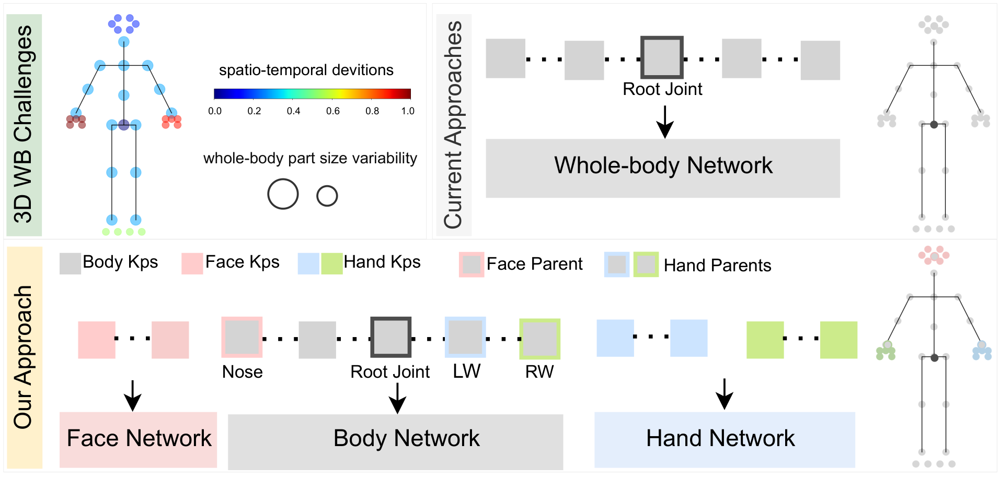

# PAFUSE: Part-based Diffusion for 3D Whole-Body Pose Estimation

Official PyTorch implementation of [**PAFUSE**](https://arxiv.org/abs/2407.10220).

> [**PAFUSE: Part-based Diffusion for 3D Whole-Body Pose Estimation**](https://arxiv.org/abs/2407.10220),            
> [Nermin Samet]([http://user.ceng.metu.edu.tr/~emre/](https://nerminsamet.github.io/)), Cédric Rommel, David Picard, Eduardo Valle,        
> *European Conference on Computer Vision (ECCV) Workshops, T-CAP, 2024.*    

[//]: # (<p align="center"></p>)
<p align="center"></p>


## Summary

In a whole-body skeleton, different keypoints have different scales and variations
which presents a challenge for spatio-temporal prediction. Current approaches
process all keypoints in a single network and, as such, have difficulties
adapting to the different statistics of each body part. Our approach groups
keypoints by body parts that share similar behavior and processes them with dedicated
networks, allowing better-adapted predictions.

<p align="center"></p>

## Dependencies

Make sure you have the following dependencies installed (python):

* pytorch >= 1.13.0
* matplotlib >= 3.3.0
* einops
* timm
* tensorboard
* hydra-core

## H3WB Dataset

<tt>PAFUSE</tt> is trained and evaluated on the [Human3.6M 3D WholeBody (H3WB)](https://github.com/wholebody3d/wholebody3d) dataset.
We used the official train and test npz files, shared in the official repository of [H3WB](https://github.com/wholebody3d/wholebody3d). 
Please donwload and put them under the `data` folder.  

## Evaluation

You can download our [pre-trained](https://github.com/valeoai/PAFUSE/releases/tag/v0.1.0) model, unzip and put it under `checkpoint` directory. To evaluate our <tt>PAFUSE</tt> using GT 2D keypoints available in the H3WB test file, please run:

```bash
python main_h3wb.py  general.checkpoint=checkpoint general.evaluate='pafuse_model.bin' ft2d.num_proposals=$PROPOSAL_NUM ft2d.sampling_timesteps=$TIMESTEP
```

You can balance efficiency and accuracy by adjusting `num_proposals` (number of hypotheses) and `sampling_timesteps`.

For visualization on H3WB, please run:
```bash
python main_draw_h3wb.py general.checkpoint=checkpoint general.evaluate='pafuse_model.bin' ft2d.num_proposals=$PROPOSAL_NUM ft2d.sampling_timesteps=$TIMESTEP
```
The results will be saved in `./plot` directory.

## Training from scratch

To train our model using the GT 2D keypoints, please run:

```bash
python main_h3wb.py  general.checkpoint=checkpoint/$SAVE_NAME  
```
## Configuration
You could adjust training and evaluation parameters accordingly in the [config file](./config/config.yaml).


## Testing on in-the-wild videos
We follow [D3DP](https://github.com/paTRICK-swk/D3DP) to test our model on custom videos. 
Note that we did not train a model specifically for **in the wild** videos.

We use [OpenPifPaf](https://github.com/openpifpaf/openpifpaf.git) to extract wholebody 2D keypoints. After installing OpenPifPaf, run the following command to get predicted 2D wholebody kps:

```bash
python3 -m openpifpaf.video --checkpoint=shufflenetv2k30-wholebody --source /path/to/video.mp4 --json-output --force-complete-pose
```

After having the 2D KPs, first change the `video_path` parameter in the `config file` to the full path of the video to test (or you can pass it as `in_the_wild.video_path` while running), then you could run the following:

```bash
python ./in_the_wild/h3wb_diffusion.py general.checkpoint=checkpoint general.evaluate='pafuse_model.bin' 
```

In order to create visuals for `in-the-wild` experiments as in our paper, you need to first install `ffmpeg`, then you can use following scripts:

```bash
file_pth=/path/to/predicted/dir
ffmpeg -framerate 5 -i $file_pth/frame%d_t4.png -vf scale=1024:720 $file_pth/pred.mp4
ffmpeg -framerate 5 -i $file_pth/frame_%d.jpg -vf scale=1024:720 $file_pth/input.mp4
ffmpeg -i $file_pth/input.mp4 -i $file_pth/pred.mp4 -filter_complex hstack $file_pth/merged.mp4
ffmpeg  -i $file_pth/merged.mp4  -vf "split[s0][s1];[s0]palettegen[p];[s1][p]paletteuse" -loop 0 $file_pth/merged.gif
```

Here you can adjust framerate to have faster running videos. 

## Citation

If you find <tt>PAFUSE</tt> useful for your research, please cite our paper as follows.

> N. Samet, C. Rommel, D. Picard, E. Valle, "PAFUSE: Part-based Diffusion for 3D Whole-Body Pose Estimation",
> European Conference on Computer Vision (ECCV) Workshops, Towards a Complete Analysis of People: Fine-grained Understanding for Real-World Applications, 2024.

BibTeX entry:
```
@inproceedings{pafuse,
  author = {Nermin Samet and Cédric Rommel and David Picard and Eduardo Valle},
  title = {PAFUSE: Part-based Diffusion for 3D Whole-Body Pose Estimation},
  booktitle = {European Conference on Computer Vision (ECCV)}
  booksubtitle = {Towards a Complete Analysis of People: Fine-grained Understanding for Real-World Applications},
  year = {2024},
}
```

## Acknowledgement
Our implementation has borrowed codes from the following repositories. We thank the authors for releasing their codes.
* [D3DP](https://github.com/paTRICK-swk/D3DP)
* [VideoPose](https://github.com/facebookresearch/VideoPose3D)
* [H3WB](https://github.com/wholebody3d/wholebody3d)


